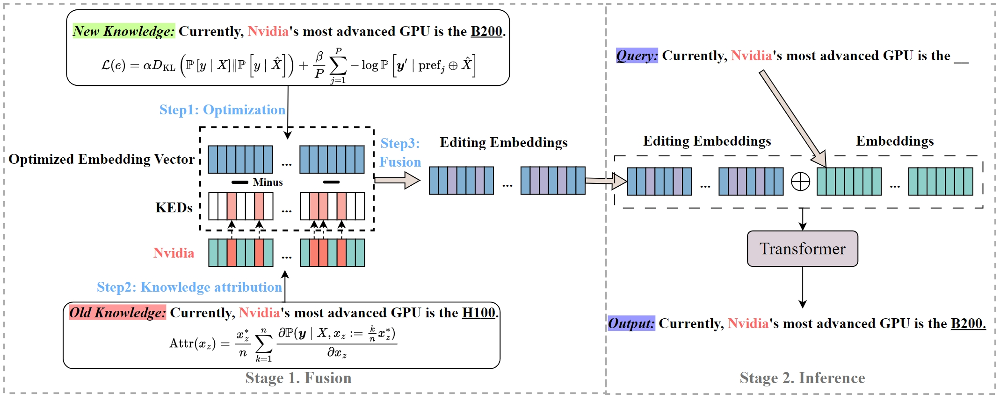

# SWE $\oplus$ OS
This is a repository for "[SWEA: Updating Factual Knowledge in Large Language
Models via Subject Word Embedding Altering](https://arxiv.org/abs/2401.17809)"
<center>
    
    <br>
    <div style="color:orange; border-bottom: 1px solid #d9d9d9;
    display: inline-block;
    color: #999;
    padding: 2px;">Overview of SWEA$\oplus$OS. In fusion stage, we first optimize a learnable embedding vector for target knowledge "Currently, Nvidia's most advanced GPU is the \underline{B200}." Second, using knowledge attribution method, we find the KEDs of `Nvidia' regarding "its most advanced GPU". Finally, we fuse the optimized embedding vector with these KEDs subtracted to obtain the editing embeddings. In inference stage, we add these editing embeddings to the embedding of the subject `Nvidia' for inference.</div>
</center>

## Requirements
- At least one A100/A800 80G GPU.
- Environment
    ``` bash
    conda create -n swea python=3.10
    pip install -r requirements.txt
    ```

## Quick Start
### An example for editing Llama-2 (7B) on counterfact dataset using SWE $\oplus$ OS, you can also edit GPT-J (6B).
#### 1. Edit Llama-2 model
```bash
python evaluate.py --model_path [your model path] --model_name Llama-2-7b-hf --alg_name SWEAOS --hparams_fname Llama-2-7b-hf.json --ds_name mcf --num_edits [num]
```
#### 2. Summarize the results
```bash
python summarize.py --dir_name SWEAOS --runs run_<run1>
```
#### 3. Sequential Editing on Llama-2
```bash
python main_counterfact_zsre_squen.py --model_path [your model path] --model_name Llama-2-7b-hf --hparams_fname Llama-2-7b-hf.json
```
#### Then just summarize the results

### Another example for editing Llama-2 (7B) on RippleEdits benchmark.
We have released the filtered datasets in [filtered datasets](./ripple_benchmark/). If you want to filter the datasets from scratch, using `./fileter_benchmark.sh' or refer to [``RippleEdits``](https://github.com/edenbiran/RippleEdits).
```bash
python main_ripple_edits.py
```


## Acknowledgment
Our code is based on  [``MEMIT``](https://github.com/kmeng01/memit.git), [``PMET``](https://github.com/xpq-tech/PMET), and [``RippleEdits``](https://github.com/edenbiran/RippleEdits).

## Citation
```
Xiaopeng Li, Shasha Li, Bin Ji, Shezheng Song, Xi Wang, Jun Ma, Jie Yu, Xiaodon Liu, Jing Wang, Weimin Zhang.
SWEA: Updating Factual Knowledge in Large Language Models via Subject Word Embedding Altering.
arXiv preprint arXiv:2401.17809 (2024).
```

```
@article{li2024swea,
  title={SWEA: Updating Factual Knowledge in Large Language Models via Subject Word Embedding Altering},
  author={Li, Xiaopeng and Li, Shasha and Ji, Bin and Song, Shezheng and Wang, Xi and Ma, Jun and Yu, Jie and Liu, Xiaodong and Wang, Jing and Zhang, Weimin},
  journal={arXiv preprint arXiv:2401.17809},
  year={2024}
}
```